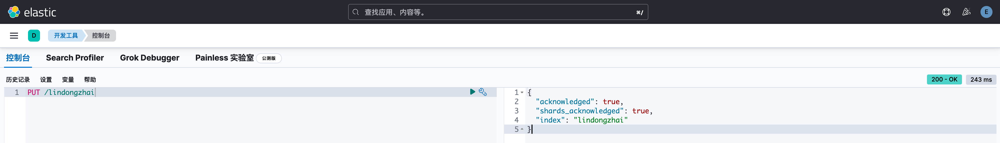
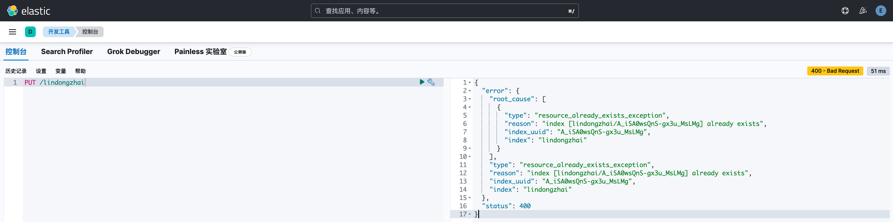
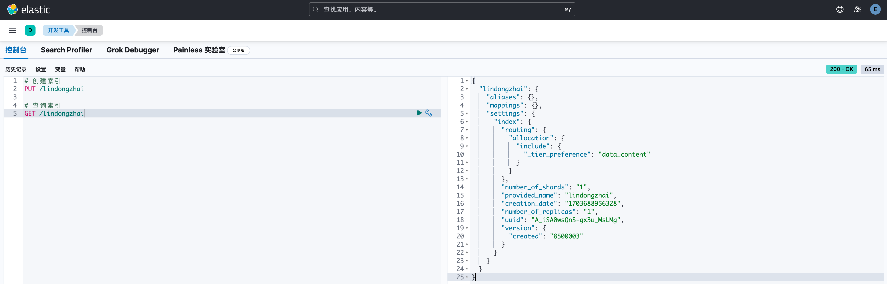
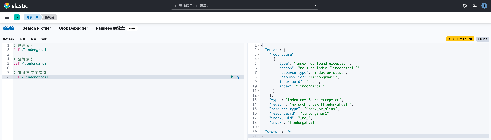
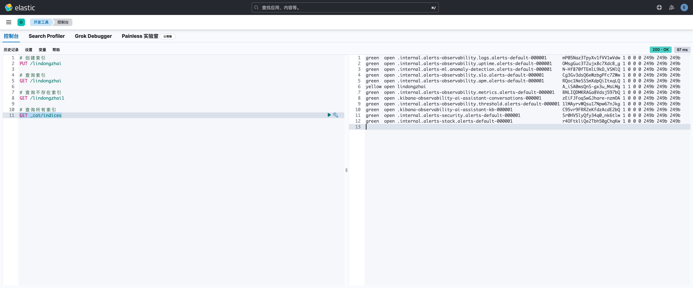
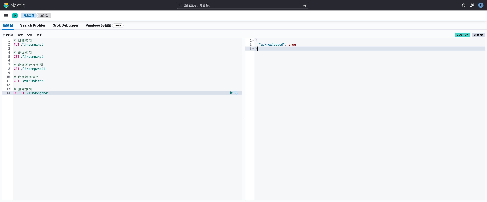
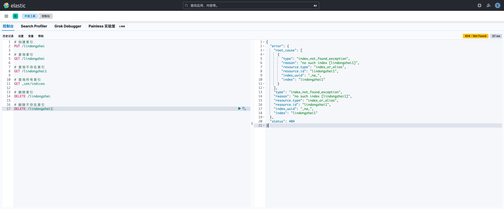

# ElasticSearch

## 一、ElaseticSearch 简介

> 官网：https://www.elastic.co/cn/elasticsearch

> 官方文档：https://www.elastic.co/guide/en/elasticsearch/reference/current/index.html

> Elasticsearch是Elastic Stack核心的分布式搜索和分析引擎。Logstash和Beats用于收集、聚合和丰富数据，并将其存储在Elasticsearch中。Kibana使您能够交互式地探索、可视化和共享数据洞察，并管理和监控整个堆栈。Elasticsearch是索引、搜索和分析数据的核心。
>
> Elasticsearch提供了几乎实时的搜索和分析功能，适用于各种类型的数据。无论您有结构化或非结构化文本、数值数据还是地理空间数据，Elasticsearch都可以高效地存储和索引，并支持快速搜索。您可以超越简单的数据检索，聚合信息以发现数据中的趋势和模式。随着数据和查询量的增长，Elasticsearch的分布式特性使得部署可以无缝地扩展。尽管不是每个问题都是搜索问题，但Elasticsearch提供了处理各种用例中的数据的速度和灵活性：
>
> - 在应用程序或网站中添加搜索框
>- 存储和分析日志、指标和安全事件数据
> - 使用机器学习实时自动对数据进行建模
> - 将Elasticsearch用作矢量数据库，创建、存储和搜索矢量嵌入
> - 使用Elasticsearch作为存储引擎自动化业务工作流程
> - 使用Elasticsearch作为地理信息系统（GIS）管理、集成和分析空间信息
> - 使用Elasticsearch作为生物信息学研究工具存储和处理基因数据
> 
> 我们对人们以搜索的方式处理数据的新颖方法感到不断惊讶。但无论您的用例与这些示例相似，还是使用Elasticsearch解决新问题，您在Elasticsearch中处理数据、文档和索引的方式都是相同的。

### 1.1、特点

1. 分布式架构：Elasticsearch 8采用分布式架构，可以将数据分布在多个节点上，实现高可用性和高性能的搜索和分析。
2. 实时搜索和分析：Elasticsearch 8能够实时地处理和索引大规模数据，提供快速的搜索和分析功能。
3. 灵活的数据模型：Elasticsearch 8采用文档型数据模型，可以存储和索引各种类型的结构化和非结构化数据。
4. 强大的查询语言：Elasticsearch 8支持丰富的查询语言，包括全文搜索、过滤、聚合等功能，可以灵活地进行数据分析和挖掘。
5. 可扩展性和可靠性：Elasticsearch 8能够轻松地水平扩展，支持集群部署，提供高可用性和容错性。
6. 开源和活跃的社区支持：Elasticsearch 8是开源软件，拥有庞大的开发者社区，提供了丰富的插件和扩展功能。


### 1.2、优点

1. 高性能：Elasticsearch 8通过优化的搜索算法和索引结构，实现了快速的搜索和分析性能。
2. 可扩展性：Elasticsearch 8能够轻松地水平扩展，支持集群部署，能够处理大规模数据。
3. 灵活的数据模型：Elasticsearch 8支持各种类型的数据存储和索引，适用于多种场景和应用。
4. 易用性：Elasticsearch 8提供了简单易用的RESTful API，可以通过HTTP请求进行交互，降低了使用和集成的复杂性。
5. 强大的查询和分析功能：Elasticsearch 8提供了丰富的查询语言和聚合功能，可以进行复杂的数据分析和挖掘。


### 1.3、缺点

1. 学习曲线较陡峭：对于新手来说，Elasticsearch 8的学习曲线可能会比较陡峭，需要花费一定的时间来熟悉其概念和技术。
2. 需要大量资源：Elasticsearch 8在处理大规模数据时可能需要大量的计算和存储资源，这可能会增加企业的运营成本。
3. 安全性问题：虽然Elasticsearch 8提供了强大的安全功能，但如果配置不当或者受到攻击，仍有可能导致数据泄露或者其他安全性问题。


### 1.4、主要用途

1. 搜索：Elasticsearch可以用于全文搜索、结构化搜索、地理位置搜索等多种类型的搜索，并且支持实时搜索和高并发访问。
2. 数据分析：Elasticsearch提供了丰富的分析工具，可以帮助企业提取有价值的信息和洞察。例如，它可以通过聚合功能进行数据统计和可视化，帮助企业更好地理解和优化其业务流程。
3. 日志管理：Elasticsearch可以用于收集、存储、索引和分析日志数据，帮助企业和开发人员监控系统运行状态和排查问题。
4. 机器学习：Elasticsearch提供了自动机器学习功能，可以自动识别异常情况并生成预测模型，帮助企业更好地理解和优化其业务流程。
5. 应用程序开发：Elasticsearch提供了一个易于使用的API，可以帮助开发者快速集成到自己的应用程序中，以实现数据存储、检索和分析等功能。


### 1.5、使用 ElasticSearch 的公司

1. Uber：Uber使用Elasticsearch来收集、存储和分析其全球业务的数据，并使用它的实时搜索功能为用户提供快速的乘车服务。
2. Netflix：Netflix使用Elasticsearch来索引和搜索其大量的电影和电视节目元数据，并使用它的可视化工具来分析用户行为和偏好。
3. Airbnb：Airbnb使用Elasticsearch来处理其全球民宿预订和评价数据，并使用它的机器学习功能来优化推荐算法。
4. LinkedIn：LinkedIn使用Elasticsearch来支持其职业社交网络的搜索和分析功能，并使用它的聚合功能来提供用户的个性化建议。
5. Twitter：Twitter使用Elasticsearch来索引和搜索其海量的社交媒体数据，并使用它的实时搜索功能来提供用户的即时消息推送。


## 二、ElastciSearch 基础概念

> Elasticsearch是面向文档(document oriented)的，这意味着它可以存储整个对象或文档(document)。然而它不仅仅是存储，还会索引(index)每个文档的内容使之可以被搜索。在Elasticsearch中，你可以对文档（而非成行成列的数据）进行索引、搜索、排序、过滤。

### 2.1、index（索引）

> 简易理解：MySQL 中的数据库

> 一个索引就是一个拥有几分相似特征的文档的集合。索引由一个名字来标识（必须全部是小写字母的），并且当我们要对对应于这个索引中的文档进行索引、搜索、更新和删除的时候，都要使用到这个名字。

### 2.2、type（类型）

<font color="Orange">注意：在 ElasticSearch8 中已经废弃，默认为 "_doc"</font>

> 简易理解：MySQL 中的表

> 在一个索引中，你可以定义一种或多种类型。一个类型是你的索引的一个逻辑上的分类/分区，其语义完全由你来定。通常，会为具有一组共同字段的文档定义一个类型。

### 2.3、document（文档）

<font color="Orange">注意：尽管一个文档，物理上存在于一个索引之中，文档必须被索引/赋予一个索引的type。</font>

> 简易理解：MySQL 中的行记录

> 一个文档是一个可被索引的基础信息单元。文档以JSON（Javascript Object Notation）格式来表示。在一个index/type里面，你可以存储任意多的文档。

### 2.4、Field（字段）

> 简易理解：MySQL 中的字段

> 对文档数据根据不同属性进行的分类标识 。

### 2.5、mapping（映射）

> 简易理解：MySQL 中的字段定义

> mapping是处理数据的方式和规则方面做一些限制，如某个字段的数据类型、默认值、分析器、是否被索引等等，这些都是映射里面可以设置的，其它就是处理es里面数据的一些使用规则设置也叫做映射，按着最优规则处理数据对性能提高很大，因此才需要建立映射，并且需要思考如何建立映射才能对性能更好。

### 2.6、cluster（集群）

<font color="Orange">注意：一个节点只能通过指定某个集群的名字来加入这个集群</font>

> 简易理解：Kubernetes 中的集群

> 一个集群就是由一个或多个节点组织在一起，它们共同持有整个的数据，并一起提供索引和搜索功能。一个集群由 一个唯一的名字标识，这个名字默认就是“elasticsearch”。

### 2.7、node（节点）

> 简易理解：Kubernetes 中的节点

> 一个节点是集群中的一个服务器，作为集群的一部分，它存储数据，参与集群的索引和搜索功能。和集群类似，一 个节点也是由一个名字来标识的，默认情况下，这个名字是一个随机的漫威漫画角色的名字，这个名字会在启动的 时候赋予节点。这个名字对于管理工作来说挺重要的，因为在这个管理过程中，你会去确定网络中的哪些服务器对 应于Elasticsearch集群中的哪些节点。
>
> 一个节点可以通过配置集群名称的方式来加入一个指定的集群。默认情况下，每个节点都会被安排加入到一个叫 做“elasticsearch”的集群中，这意味着，如果你在你的网络中启动了若干个节点，并假定它们能够相互发现彼此， 它们将会自动地形成并加入到一个叫做“elasticsearch”的集群中。
> 在一个集群里，只要你想，可以拥有任意多个节点。而且，如果当前你的网络中没有运行任何Elasticsearch节点， 这时启动一个节点，会默认创建并加入一个叫做“elasticsearch”的集群。

### 2.8、shards&replicas（分片和复制）

> 简易理解：会将一个索引的文件进行分布式存储，且创建副本避免数据的丢失，类似 raid

> Elasticsearch允许将索引划分为多个分片，每个分片都是功能完整的独立“索引”，可以放置在集群中的任何节点上。分片的目的主要是为了水平分割内容容量和实现分布式并行操作以提高性能/吞吐量。同时，Elasticsearch还支持创建复制分片作为主分片的备份，用于故障转移和提供高可用性。复制分片也可以帮助扩展搜索量和吞吐量，因为搜索可以在所有复制分片上并行运行。默认情况下，Elasticsearch中的每个索引包含5个主分片和1个复制，如果集群中至少有两个节点，则每个索引会有5个主分片和5个复制分片（总共10个分片）。

### 2.9、正排索引&倒排索引

* 正排索引

  > 正排索引是一种记录文档中每个单词出现在哪些文档中的数据结构。它将每个单词作为主键，对应的值是一个列表，列表中的元素是包含该单词的文档编号。这样就可以通过查询一个单词来快速获取包含这个单词的所有文档编号。
  >
  > | ID   | 开发语言     |
  > | ---- | ------------ |
  > | 1    | python       |
  > | 2    | java         |
  > | 3    | python，java |
  > | 4    | golang       |
  >
  > 

* 倒排索引

  > 倒排索引是一种记录每个文档中哪些单词出现及次数的数据结构。与正排索引相反，倒排索引将每个文档作为主键，对应的值是一个列表，列表中的元素是文档中出现的单词及其频率。这样就可以通过查询一个文档来快速获取该文档中所有单词的信息。
  >
  > | 开发语言 | ID   |
  > | -------- | ---- |
  > | python   | 1，3 |
  > | java     | 2，3 |
  > | golang   | 4    |

### 2.10、文档得分


## 三、ElasticSearch 配置文件说明

### 3.1、Elasticsearch配置文件（elasticsearch.yml）

> 路径：$ES_HOME/config/elasticsearch.yml

> 更改方法：`export ES_PATH_CONF=/path/to/my/config`


## 四、Kibana 使用


## 五、索引操作

### 5.1、新建索引

```http
PUT /indexName
```

```sh
curl -XPUT "https://172.19.0.2:9200/lindongzhai" -H "kbn-xsrf: reporting"
```


* 创建成功响应

    ```json
    {
      "acknowledged": true,
      "shards_acknowledged": true,
      "index": "lindongzhai"
    }
    ```

    

* 索引已存在错误响应

    ```json
    {
      "error": {
        "root_cause": [
          {
            "type": "resource_already_exists_exception",
            "reason": "index [lindongzhai/A_iSA0wsQnS-gx3u_MsLMg] already exists",
            "index_uuid": "A_iSA0wsQnS-gx3u_MsLMg",
            "index": "lindongzhai"
          }
        ],
        "type": "resource_already_exists_exception",
        "reason": "index [lindongzhai/A_iSA0wsQnS-gx3u_MsLMg] already exists",
        "index_uuid": "A_iSA0wsQnS-gx3u_MsLMg",
        "index": "lindongzhai"
      },
      "status": 400
    }
    ```

    

### 5.2、查询索引

```http
GET /indexName
```

* 索引存在

    ```JSON
    {
      "lindongzhai": {
        "aliases": {},
        "mappings": {},
        "settings": {
          "index": {
            "routing": {
              "allocation": {
                "include": {
                  "_tier_preference": "data_content"
                }
              }
            },
            "number_of_shards": "1",
            "provided_name": "lindongzhai",
            "creation_date": "1703688956328",
            "number_of_replicas": "1",
            "uuid": "A_iSA0wsQnS-gx3u_MsLMg",
            "version": {
              "created": "8500003"
            }
          }
        }
      }
    }
    ```

    

* 索引不存在

    ```json
    {
      "error": {
        "root_cause": [
          {
            "type": "index_not_found_exception",
            "reason": "no such index [lindongzhai1]",
            "resource.type": "index_or_alias",
            "resource.id": "lindongzhai1",
            "index_uuid": "_na_",
            "index": "lindongzhai1"
          }
        ],
        "type": "index_not_found_exception",
        "reason": "no such index [lindongzhai1]",
        "resource.type": "index_or_alias",
        "resource.id": "lindongzhai1",
        "index_uuid": "_na_",
        "index": "lindongzhai1"
      },
      "status": 404
    }
    ```

    

### 5.3、所有索引

```http
GET _cat/indices
```

```json
green  open .internal.alerts-observability.logs.alerts-default-000001      mP05Naz3TpyXv1fVV1wVdw 1 0 0 0 249b 249b 249b
green  open .internal.alerts-observability.uptime.alerts-default-000001    OMsgGuc3T2ujx8c7XdcB_g 1 0 0 0 249b 249b 249b
green  open .internal.alerts-ml.anomaly-detection.alerts-default-000001    N-Hf870fTEmlL9kD_VSNlQ 1 0 0 0 249b 249b 249b
green  open .internal.alerts-observability.slo.alerts-default-000001       Cg3Gv3dsQ6eWzbgPFc72Ww 1 0 0 0 249b 249b 249b
green  open .internal.alerts-observability.apm.alerts-default-000001       RQoc1NeSSSmXdpQiItxqLQ 1 0 0 0 249b 249b 249b
yellow open lindongzhai                                                    A_iSA0wsQnS-gx3u_MsLMg 1 1 0 0 249b 249b 249b
green  open .internal.alerts-observability.metrics.alerts-default-000001   BNLIQDMKRAGa8Vdsj597bQ 1 0 0 0 249b 249b 249b
green  open .kibana-observability-ai-assistant-conversations-000001        zEiFJFoqSwGJhare-nzmOA 1 0 0 0 249b 249b 249b
green  open .internal.alerts-observability.threshold.alerts-default-000001 1lMAyrvWQsu17Npw67nJkg 1 0 0 0 249b 249b 249b
green  open .kibana-observability-ai-assistant-kb-000001                   C95vr9FRR2eKfdzAcdE2bQ 1 0 0 0 249b 249b 249b
green  open .internal.alerts-security.alerts-default-000001                Sr0HV5lyQfy34q0_nk6tlw 1 0 0 0 249b 249b 249b
green  open .internal.alerts-stack.alerts-default-000001                   r4OFtkliQe2Tbh50gChqKw 1 0 0 0 249b 249b 249b
```



> 查询结果说明
>
> | 内容                   | 含义           | 具体描述                                                     |
> | ---------------------- | -------------- | ------------------------------------------------------------ |
> | green                  | health         | 当前服务器健康状态，green（集群完整），yellow（单点正常、集群不完整），red（单点不正常） |
> | open                   | status         | 索引打开、关闭状态                                           |
> | lindongzhai            | index          | 索引名称                                                     |
> | A_iSA0wsQnS-gx3u_MsLMg | uuid           | 索引唯一编号                                                 |
> | 1                      | pri            | 主分片数量                                                   |
> | 1                      | rep            | 副本数量                                                     |
> | 0                      | docs.count     | 可用文档数（已有文档数）                                     |
> | 0                      | docs.deleted   | 已删除文档数（逻辑删除/软删除）                              |
> | 249b                   | store.size     | 主分片和副分片整体占空间大小                                 |
> | 249b                   | pri.store.size | 主分片占空间大小                                             |
>
> 

### 5.4、删除索引

```HTTP
DELETE /indexName
```

* 删除成功

    ```JSON
    {
      "acknowledged": true
    }
    ```

    

* 删除不存在索引

    ```JSON
    {
      "error": {
        "root_cause": [
          {
            "type": "index_not_found_exception",
            "reason": "no such index [lindongzhai1]",
            "resource.type": "index_or_alias",
            "resource.id": "lindongzhai1",
            "index_uuid": "_na_",
            "index": "lindongzhai1"
          }
        ],
        "type": "index_not_found_exception",
        "reason": "no such index [lindongzhai1]",
        "resource.type": "index_or_alias",
        "resource.id": "lindongzhai1",
        "index_uuid": "_na_",
        "index": "lindongzhai1"
      },
      "status": 404
    }
    ```

    

## 六、文档操作

### 6.1、新增文档

```http

```


## 七、数据搜索

### 7.1、基础搜索

### 7.2、聚合搜索

## 八、索引模板

## 九、中文分词

### 9.1、原生分词

### 9.2、IK分词器


## 六、IK分词器

### 6.1、安装

<font color="Orange">注意：安装的版本需与ElasticSearch版本一致</font>

> 下载地址：https://github.com/medcl/elasticsearch-analysis-ik/releases


## 十、SDK 使用

### 7.1、Golang


### 7.2、Java


### 7.3、Python


## 附录

### 1、ElasticSearch 安装

> 官方教程：https://www.elastic.co/guide/en/elasticsearch/reference/current/install-elasticsearch.html

#### 1.1、docker 安装

```SH
# 创建虚拟网络
docker network create elastic
# 拉取镜像
docker pull docker.elastic.co/elasticsearch/elasticsearch:8.11.3
# 安装证书
wget https://artifacts.elastic.co/cosign.pub
cosign verify --key cosign.pub docker.elastic.co/elasticsearch/elasticsearch:8.11.3
# 执行 ElasticSearch
docker run --name es01 --net elastic -p 9200:9200 -it -m 1GB docker.elastic.co/elasticsearch/elasticsearch:8.11.3
# 后台执行 ElasticSearch
docker run --name es01 --net elastic -p 9200:9200 -it -m 1GB -d docker.elastic.co/elasticsearch/elasticsearch:8.11.3
```

#### 1.2、Windows 安装


#### 1.3、Linux 安装


#### 1.4、Mac 安装


### 2、Kibana 安装

> 官方教程：https://www.elastic.co/guide/en/elasticsearch/reference/current/install-elasticsearch.html

#### 2.1、docker 安装

```sh
# 拉取镜像
docker pull docker.elastic.co/kibana/kibana:8.11.3
# 安装证书
wget https://artifacts.elastic.co/cosign.pub
cosign verify --key cosign.pub docker.elastic.co/kibana/kibana:8.11.3
# 执行 Kibana
docker run --name kib01 --net elastic -p 5601:5601 docker.elastic.co/kibana/kibana:8.11.3
# 后台执行 kibana
docker run --name kib01 --net elastic -p 5601:5601 -d docker.elastic.co/kibana/kibana:8.11.3
```


#### 2.2、Windows 安装

#### 2.3、Linux 安装

#### 2.4、Mac 安装

