# ElasticSearch

## 一、ElaseticSearch 简介

> 官网：https://www.elastic.co/cn/elasticsearch

> 官方文档：https://www.elastic.co/guide/en/elasticsearch/reference/current/index.html

> Elasticsearch是Elastic Stack核心的分布式搜索和分析引擎。Logstash和Beats用于收集、聚合和丰富数据，并将其存储在Elasticsearch中。Kibana使您能够交互式地探索、可视化和共享数据洞察，并管理和监控整个堆栈。Elasticsearch是索引、搜索和分析数据的核心。
>
> Elasticsearch提供了几乎实时的搜索和分析功能，适用于各种类型的数据。无论您有结构化或非结构化文本、数值数据还是地理空间数据，Elasticsearch都可以高效地存储和索引，并支持快速搜索。您可以超越简单的数据检索，聚合信息以发现数据中的趋势和模式。随着数据和查询量的增长，Elasticsearch的分布式特性使得部署可以无缝地扩展。尽管不是每个问题都是搜索问题，但Elasticsearch提供了处理各种用例中的数据的速度和灵活性：
>
> - 在应用程序或网站中添加搜索框
>- 存储和分析日志、指标和安全事件数据
> - 使用机器学习实时自动对数据进行建模
> - 将Elasticsearch用作矢量数据库，创建、存储和搜索矢量嵌入
> - 使用Elasticsearch作为存储引擎自动化业务工作流程
> - 使用Elasticsearch作为地理信息系统（GIS）管理、集成和分析空间信息
> - 使用Elasticsearch作为生物信息学研究工具存储和处理基因数据
> 
> 我们对人们以搜索的方式处理数据的新颖方法感到不断惊讶。但无论您的用例与这些示例相似，还是使用Elasticsearch解决新问题，您在Elasticsearch中处理数据、文档和索引的方式都是相同的。

### 1.1、特点

1. 分布式架构：Elasticsearch 8采用分布式架构，可以将数据分布在多个节点上，实现高可用性和高性能的搜索和分析。
2. 实时搜索和分析：Elasticsearch 8能够实时地处理和索引大规模数据，提供快速的搜索和分析功能。
3. 灵活的数据模型：Elasticsearch 8采用文档型数据模型，可以存储和索引各种类型的结构化和非结构化数据。
4. 强大的查询语言：Elasticsearch 8支持丰富的查询语言，包括全文搜索、过滤、聚合等功能，可以灵活地进行数据分析和挖掘。
5. 可扩展性和可靠性：Elasticsearch 8能够轻松地水平扩展，支持集群部署，提供高可用性和容错性。
6. 开源和活跃的社区支持：Elasticsearch 8是开源软件，拥有庞大的开发者社区，提供了丰富的插件和扩展功能。


### 1.2、优点

1. 高性能：Elasticsearch 8通过优化的搜索算法和索引结构，实现了快速的搜索和分析性能。
2. 可扩展性：Elasticsearch 8能够轻松地水平扩展，支持集群部署，能够处理大规模数据。
3. 灵活的数据模型：Elasticsearch 8支持各种类型的数据存储和索引，适用于多种场景和应用。
4. 易用性：Elasticsearch 8提供了简单易用的RESTful API，可以通过HTTP请求进行交互，降低了使用和集成的复杂性。
5. 强大的查询和分析功能：Elasticsearch 8提供了丰富的查询语言和聚合功能，可以进行复杂的数据分析和挖掘。


### 1.3、缺点

1. 学习曲线较陡峭：对于新手来说，Elasticsearch 8的学习曲线可能会比较陡峭，需要花费一定的时间来熟悉其概念和技术。
2. 需要大量资源：Elasticsearch 8在处理大规模数据时可能需要大量的计算和存储资源，这可能会增加企业的运营成本。
3. 安全性问题：虽然Elasticsearch 8提供了强大的安全功能，但如果配置不当或者受到攻击，仍有可能导致数据泄露或者其他安全性问题。


### 1.4、主要用途

1. 搜索：Elasticsearch可以用于全文搜索、结构化搜索、地理位置搜索等多种类型的搜索，并且支持实时搜索和高并发访问。
2. 数据分析：Elasticsearch提供了丰富的分析工具，可以帮助企业提取有价值的信息和洞察。例如，它可以通过聚合功能进行数据统计和可视化，帮助企业更好地理解和优化其业务流程。
3. 日志管理：Elasticsearch可以用于收集、存储、索引和分析日志数据，帮助企业和开发人员监控系统运行状态和排查问题。
4. 机器学习：Elasticsearch提供了自动机器学习功能，可以自动识别异常情况并生成预测模型，帮助企业更好地理解和优化其业务流程。
5. 应用程序开发：Elasticsearch提供了一个易于使用的API，可以帮助开发者快速集成到自己的应用程序中，以实现数据存储、检索和分析等功能。


### 1.5、使用 ElasticSearch 的公司

1. Uber：Uber使用Elasticsearch来收集、存储和分析其全球业务的数据，并使用它的实时搜索功能为用户提供快速的乘车服务。
2. Netflix：Netflix使用Elasticsearch来索引和搜索其大量的电影和电视节目元数据，并使用它的可视化工具来分析用户行为和偏好。
3. Airbnb：Airbnb使用Elasticsearch来处理其全球民宿预订和评价数据，并使用它的机器学习功能来优化推荐算法。
4. LinkedIn：LinkedIn使用Elasticsearch来支持其职业社交网络的搜索和分析功能，并使用它的聚合功能来提供用户的个性化建议。
5. Twitter：Twitter使用Elasticsearch来索引和搜索其海量的社交媒体数据，并使用它的实时搜索功能来提供用户的即时消息推送。
5. 小米、滴滴、携程等


### 1.6、ElasticSearch的由来

许多年前，一个刚结婚的名叫 Shay Banon 的失业开发者，跟着他的妻子去了伦敦，他的妻子在那里学习厨师。 在寻找一个赚钱的工作的时候，为了给他的妻子做一个食谱搜索引擎，他开始使用 Lucene 的一个早期版本。

直接使用 Lucene 是很难的，因此 Shay 开始做一个抽象层，Java 开发者使用它可以很简单的给他们的程序添加搜索功能。 他发布了他的第一个开源项目 Compass。

后来 Shay 获得了一份工作，主要是高性能，分布式环境下的内存数据网格。这个对于高性能，实时，分布式搜索引擎的需求尤为突出， 他决定重写 Compass，把它变为一个独立的服务并取名 Elasticsearch。

第一个公开版本在2010年2月发布，从此以后，Elasticsearch 已经成为了 Github 上最活跃的项目之一，他拥有超过300名 contributors(目前736名 contributors )。 一家公司已经开始围绕 Elasticsearch 提供商业服务，并开发新的特性，但是，Elasticsearch 将永远开源并对所有人可用。

据说，Shay 的妻子还在等着她的食谱搜索引擎...


## 二、ElastciSearch 基础概念

Elasticsearch是面向文档(document oriented)的，这意味着它可以存储整个对象或文档(document)。然而它不仅仅是存储，还会索引(index)每个文档的内容使之可以被搜索。在Elasticsearch中，你可以对文档（而非成行成列的数据）进行索引、搜索、排序、过滤。

### 2.1、index（索引）

> 简易理解：MySQL 中的数据库

一个索引就是一个拥有几分相似特征的文档的集合。索引由一个名字来标识（必须全部是小写字母的），并且当我们要对对应于这个索引中的文档进行索引、搜索、更新和删除的时候，都要使用到这个名字。


### 2.2、type（类型）

> 简易理解：MySQL 中的表

在一个索引中，你可以定义一种或多种类型。一个类型是你的索引的一个逻辑上的分类/分区，其语义完全由你来定。通常，会为具有一组共同字段的文档定义一个类型。

<font color="Orange">注意：在 ElasticSearch8 中已经废弃，默认为 "_doc"</font>


### 2.3、document（文档）

> 简易理解：MySQL 中的行记录

一个文档是一个可被索引的基础信息单元。文档以JSON（Javascript Object Notation）格式来表示。在一个index/type里面，你可以存储任意多的文档。

<font color="Orange">注意：尽管一个文档，物理上存在于一个索引之中，文档必须被索引/赋予一个索引的type。</font>


### 2.4、Field（字段）

> 简易理解：MySQL 中的字段

对文档数据根据不同属性进行的分类标识 。


### 2.5、mapping（映射）

> 简易理解：MySQL 中的字段定义

mapping是处理数据的方式和规则方面做一些限制，如某个字段的数据类型、默认值、分析器、是否被索引等等，这些都是映射里面可以设置的，其它就是处理es里面数据的一些使用规则设置也叫做映射，按着最优规则处理数据对性能提高很大，因此才需要建立映射，并且需要思考如何建立映射才能对性能更好。


### 2.6、cluster（集群）

> 简易理解：Kubernetes 中的集群

一个集群就是由一个或多个节点组织在一起，它们共同持有整个的数据，并一起提供索引和搜索功能。一个集群由 一个唯一的名字标识，这个名字默认就是“elasticsearch”。

<font color="Orange">注意：一个节点只能通过指定某个集群的名字来加入这个集群</font>


### 2.7、node（节点）

> 简易理解：Kubernetes 中的节点

一个节点是集群中的一个服务器，作为集群的一部分，它存储数据，参与集群的索引和搜索功能。和集群类似，一 个节点也是由一个名字来标识的，默认情况下，这个名字是一个随机的漫威漫画角色的名字，这个名字会在启动的 时候赋予节点。这个名字对于管理工作来说挺重要的，因为在这个管理过程中，你会去确定网络中的哪些服务器对 应于Elasticsearch集群中的哪些节点。
一个节点可以通过配置集群名称的方式来加入一个指定的集群。默认情况下，每个节点都会被安排加入到一个叫 做“elasticsearch”的集群中，这意味着，如果你在你的网络中启动了若干个节点，并假定它们能够相互发现彼此， 它们将会自动地形成并加入到一个叫做“elasticsearch”的集群中。
在一个集群里，只要你想，可以拥有任意多个节点。而且，如果当前你的网络中没有运行任何Elasticsearch节点， 这时启动一个节点，会默认创建并加入一个叫做“elasticsearch”的集群。


### 2.8、shards&replicas（分片和复制）

> 简易理解：会将一个索引的文件进行分布式存储，且创建副本避免数据的丢失，类似 raid

Elasticsearch允许将索引划分为多个分片，每个分片都是功能完整的独立“索引”，可以放置在集群中的任何节点上。分片的目的主要是为了水平分割内容容量和实现分布式并行操作以提高性能/吞吐量。同时，Elasticsearch还支持创建复制分片作为主分片的备份，用于故障转移和提供高可用性。复制分片也可以帮助扩展搜索量和吞吐量，因为搜索可以在所有复制分片上并行运行。默认情况下，Elasticsearch中的每个索引包含5个主分片和1个复制，如果集群中至少有两个节点，则每个索引会有5个主分片和5个复制分片（总共10个分片）。


### 2.9、正排索引&倒排索引

* 正排索引

  * 正排索引是一种记录文档中每个单词出现在哪些文档中的数据结构。它将每个单词作为主键，对应的值是一个列表，列表中的元素是包含该单词的文档编号。这样就可以通过查询一个单词来快速获取包含这个单词的所有文档编号。
    | ID   | 开发语言     |
    | ---- | ------------ |
    | 1    | python       |
    | 2    | java         |
    | 3    | python，java |
    | 4    | golang       |

* 倒排索引

  > 倒排索引是一种记录每个文档中哪些单词出现及次数的数据结构。与正排索引相反，倒排索引将每个文档作为主键，对应的值是一个列表，列表中的元素是文档中出现的单词及其频率。这样就可以通过查询一个文档来快速获取该文档中所有单词的信息。
  >
  > | 开发语言 | ID   |
  > | -------- | ---- |
  > | python   | 1，3 |
  > | java     | 2，3 |
  > | golang   | 4    |

### 2.10、文档得分

$$
score=(q,d) = coord(q,d)·queryNorm(q)·∑(tf(t in d)·idf(t)²·t.getBoot()·norm(t,d))
$$

> 公式中将查询作为输入，使用不同的手段来确定每一篇文档的得分，将每一个因素最后通过公式综合起来，返回该文档的最终得分。  

> 查看得分情况：`GET /索引名称/_search?explain=true`


#### 2.10.1、名词讲解

TF（Term Frequency）【词频】：搜索文本中的各个词条（term）在查询文本中出现了多少次，出现次数越多，就越相关，得分会比较高

IDF（Inverse Document Frequency）【逆文档频率】：搜索文本中的各个词条（term）在整个索引的所有文档中出现了多少次，出现的次数越多，说明越不重要，也就越不相关，得分就比较低。


#### 2.10.2、TF 计算

```json
{
    "value": 0.45454544,
    "description": "tf, computed as freq / (freq + k1 * (1 - b + b * dl / avgdl)) from:",
    "details": [
        {
            "value": 1,
            "description": "freq, occurrences of term within document",
            "details": []
        },
        {
            "value": 1.2,
            "description": "k1, term saturation parameter",
            "details": []
        },
        {
            "value": 0.75,
            "description": "b, length normalization parameter",
            "details": []
        },
        {
            "value": 1,
            "description": "dl, length of field",
            "details": []
        },
        {
            "value": 1,
            "description": "avgdl, average length of field",
            "details": []
        }
    ]
}
```


$$
freq / (freq + k1 * (1 - b + b * dl / avgdl))
$$

| 参数  | 含义                                             | 默认值 |
| ----- | ------------------------------------------------ | ------ |
| freq  | 文档中出现词条的次数                             | 无     |
| k1    | 术语饱和参数                                     | 1.2    |
| b     | 长度规格化参数（单词长度对于整个文档的影响程度） | 0.75   |
| dl    | 当前文中分解的字段长度                           | 无     |
| avgdl | 查询文档中分解字段数量/查询文档数量              | 无     |

#### 2.10.3、IDF 计算

```json
{
    "value": 1.3862944,
    "description": "idf, computed as log(1 + (N - n + 0.5) / (n + 0.5)) from:",
    "details": [
        {
            "value": 1,
            "description": "n, number of documents containing term",
            "details": []
        },
        {
            "value": 5,
            "description": "N, total number of documents with field",
            "details": []
        }
    ]
}
```

$$
log(1 + (N - n + 0.5) / (n + 0.5))
$$

| 参数 | 含义                                         | 默认值 |
| ---- | -------------------------------------------- | ------ |
| N    | 包含查询字段的文档总数（不一定包含查询词条） | 无     |
| n    | 包含查询词条的文档数                         | 无     |

#### 2.10.4、文档得分 计算

$$
boost * idf * tf
$$

| 参数  | 含义                 | 默认值                      |
| ----- | -------------------- | --------------------------- |
| boost | 词条权重             | 2.2（基础值） * 查询权重(1) |
| idf   | 包含查询词条的文档数 | 无                          |
| tf    | 词频                 | 无                          |


## 三、ElasticSearch 配置文件说明

### 3.1、Elasticsearch配置文件（elasticsearch.yml）

官方文档：https://www.elastic.co/guide/en/elasticsearch/reference/current/settings.html

路径：$ES_HOME/config/elasticsearch.yml

更改方法：`export ES_PATH_CONF=/path/to/my/config`

```yaml
# ---------------------------------- Cluster -----------------------------------
# ---------------------------------- 集群配置 -----------------------------------
# 集群名称，使用（默认注释）
cluster.name: my-application

# ------------------------------------ Node ------------------------------------
# ------------------------------------ 节点 ------------------------------------
# 节点名称（默认注释）
node.name: node-1
# 节点的自定义属性（默认注释）
node.attr.rack: r1
# 是否有资格选举 node
node.master: true 

# ----------------------------------- Paths ------------------------------------
# ----------------------------------- 路径集 ------------------------------------
# 存储数据的目录路径（用逗号分隔多个位置）（默认注释）
path.data: /path/to/data
# 日志位置（默认注释）
path.logs: /path/to/logs
# 临时文件位置（默认注释）
path.work: /path/to/work
# 配置文件位置（默认注释）
path.conf: /path/to/conf
# 插件位置
path.plugins: /path/to/plugins

# ----------------------------------- Memory -----------------------------------
# ----------------------------------- 内存 -----------------------------------
# 启动时锁定内存（默认注释）
bootstrap.memory_lock: true

# ---------------------------------- Network -----------------------------------
# ---------------------------------- 网络 -----------------------------------
# 默认情况下，Elasticsearch 只能在本地主机上访问。 此处设置不同的地址以在网络上公开该节点：（默认注释）
# 当填写时，ES假定从开发模式转向生产模式，并将许多系统启动检查从警告升级为异常
network.host: 192.168.0.1
# 默认情况下，Elasticsearch 在第一个空闲端口上侦听 HTTP 流量（默认注释）
# 查找从 9200 开始。在此处设置特定的 HTTP 端口（默认注释）
http.port: 9200

# --------------------------------- Discovery ----------------------------------
# --------------------------------- 发现 ----------------------------------
# 传递初始主机列表以在该节点启动时执行发现：
discovery.seed_hosts: ["host1", "host2"]
# 使用一组初始的符合主节点资格的节点引导集群：
cluster.initial_master_nodes: ["node-1", "node-2"]

# ---------------------------------- Various -----------------------------------
# ---------------------------------- 各种各样 -----------------------------------
# Allow wildcard deletion of indices:
action.destructive_requires_name: false

#----------------------- BEGIN SECURITY AUTO CONFIGURATION -----------------------
#----------------------- 开始安全自动配置 -----------------------

# 是否启用安全特性
xpack.security.enabled: true
# 启用X-Pack安全特性中的Enrollment特性。该特性允许节点通过证书自动加入集群。
xpack.security.enrollment.enabled: true

# 为HTTP API客户端连接(如Kibana、Logstash和Agents)启用加密
xpack.security.http.ssl:
  # 表示启用SSL/TLS加密。
  enabled: true
  # 指定SSL证书文件的路径。
  keystore.path: certs/http.p12

# 开启集群节点间的加密和相互认证功能
xpack.security.transport.ssl:
  # 表示启用SSL/TLS加密。
  enabled: true
  # 表示使用证书进行节点身份验证。
  verification_mode: certificate
  # 指定SSL证书文件的路径。
  keystore.path: certs/transport.p12
  # 指定SSL信任证书库文件的路径。
  truststore.path: certs/transport.p12

# 仅使用当前节点创建一个新集群
# 以后，其他节点仍然可以加入集群
cluster.initial_master_nodes: ["DZ-PC"]

# 监听地址，0.0.0.0 表示监听来自任何地方的 HTTP API 连接
http.host: 0.0.0.0

# 允许其他节点从任何地方加入集群
# 连接经过加密并相互验证
transport.host: 0.0.0.0

#----------------------- END SECURITY AUTO CONFIGURATION -------------------------
#----------------------- 结束安全自动配置 -------------------------
```

### 3.2、JVM配置文件（jvm.options）

官方文档：

* https://www.oracle.com/java/technologies/javase/vmoptions-jsp.html

* https://www.elastic.co/guide/en/elasticsearch/reference/8.11/advanced-configuration.html#set-jvm-options

* https://www.elastic.co/guide/en/elasticsearch/reference/8.11/important-settings.html#heap-size-settings

配置文件路径：$ES_HOME/config/jvm.options

```properties
# 启用 G1 垃圾回收器。
-XX:+UseG1GC

## JVM临时目录
-Djava.io.tmpdir=${ES_TMPDIR}

# 利用加速矢量硬件指令;移除这个可能
# 导致矢量性能不太理想
20-:--add-modules=jdk.incubator.vector

# 当从Java堆分配失败时生成堆转储;堆转储将在JVM的工作目录中创建，除非指定了替代路径
-XX:+HeapDumpOnOutOfMemoryError

# 在内存不足错误发生堆转储后立即退出
-XX:+ExitOnOutOfMemoryError

# 指定堆转储的替代路径;确保目录存在并且有足够的空间
-XX:HeapDumpPath=data

# 为JVM致命错误日志指定一个替代路径
-XX:ErrorFile=logs/hs_err_pid%p.log

## GC日志记录
-Xlog:gc*,gc+age=trace,safepoint:file=logs/gc.log:utctime,level,pid,tags:filecount=32,filesize=64m
```

### 3.3、log4j2.properties

官方文档：https://logging.apache.org/log4j/2.x/manual/configuration.html

配置文件路径：$ES_HOME/config/log4j2.properties"

## 四、ELastic Stack生态

> Beats + Logstash + ElasticSearch + Kibana

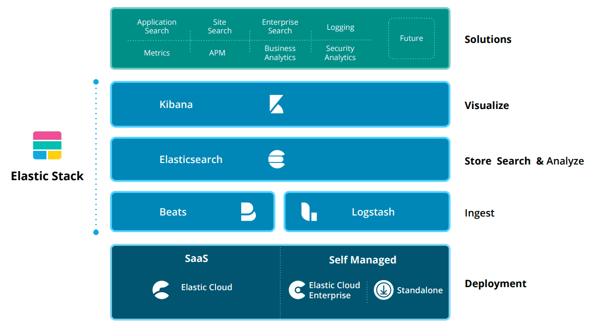

### 4.1、Beats

Beats是一个面向<font color="cyan">轻量型采集器</font>的平台，这些采集器可以从边缘机器向Logstash、ElasticSearch发送数据，它是由Go语言进行开发的，运行效率方面比较快。从下图中可以看出，不同Beats的套件是针对不同的数据源。


### 4.2、Logstash

Logstash是<font color="cyan">动态数据收集管道</font>，拥有可扩展的插件生态系统，支持从不同来源采集数据，转换数据，并将数据发送到不同的存储库中。其能够与ElasticSearch产生强大的协同作用，后被Elastic公司在2013年收购。具有以下特性：

1. 实时解析和转换数据；
2. 可扩展，具有200多个插件；
3. 可靠性、安全性。Logstash会通过持久化队列来保证至少将运行中的事件送达一次，同时将数据进行传输加密；
4. 监控；


### 4.3、ElasticSearch

ElasticSearch对数据进行<font color="cyan">搜索、分析和存储</font>，其是基于JSON的分布式搜索和分析引擎，专门为实现水平可扩展性、高可靠性和管理便捷性而设计的。

它的实现原理主要分为以下几个步骤：

1. 首先用户将数据提交到ElasticSearch数据库中；

2. 再通过分词控制器将对应的语句分词；

3. 将分词结果及其权重一并存入，以备用户在搜索数据时，根据权重将结果排名和打分，将返回结果呈现给用户；


### 4.4、Kibana

Kibana实现<font color="cyan">数据可视化</font>，其作用就是在ElasticSearch中进行民航。Kibana能够以图表的形式呈现数据，并且具有可扩展的用户界面，可以全方位的配置和管理ElasticSearch。

Kibana最早的时候是基于Logstash创建的工具，后被Elastic公司在2013年收购。

1. Kibana可以提供各种可视化的图表；

2. 可以通过机器学习的技术，对异常情况进行检测，用于提前发现可疑问题；


### 4.5、从日志收集系统看ES Stack的发展

> 我们看下ELK技术栈的演化，通常体现在日志收集系统中。

一个典型的日志系统包括：

1. 收集：能够采集多种来源的日志数据

2. 传输：能够稳定的把日志数据解析过滤并传输到存储系统

3. 存储：存储日志数据

4. 分析：支持 UI 分析

5. 警告：能够提供错误报告，监控机制

#### 4.5.1、Betas + ElasticSearch + Kibana

Beats采集数据后，存储在ES中，在Kibana可视化的展示。

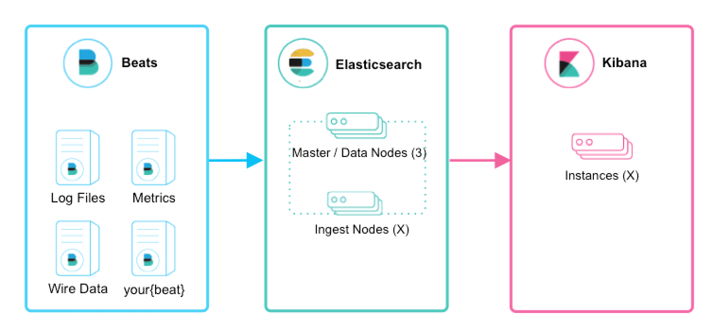

#### 4.5.2、Betas + Logstath + ElasticSearch + Kibana

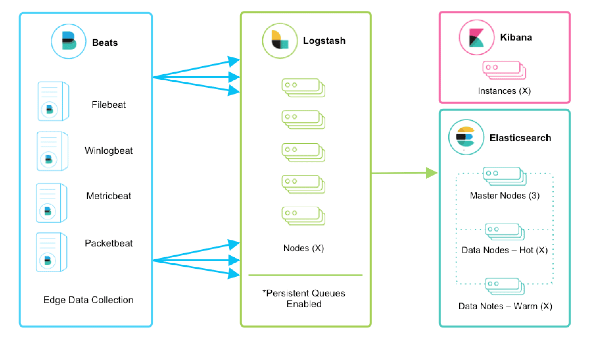

该框架是在上面的框架的基础上引入了logstash，引入logstash带来的好处如下：

1. Logstash具有基于磁盘的自适应缓冲系统，该系统将吸收传入的吞吐量，从而减轻背压。

2. 从其他数据源（例如数据库，S3或消息传递队列）中提取。

3. 将数据发送到多个目的地，例如S3，HDFS或写入文件。

4. 使用条件数据流逻辑组成更复杂的处理管道。

<font color="cyan">beats结合logstash带来的优势</font>

1. 水平可扩展性，高可用性和可变负载处理：beats和logstash可以实现节点之间的负载均衡，多个logstash可以实现logstash的高可用

2. 消息持久性与至少一次交付保证：使用beats或Winlogbeat进行日志收集时，可以保证至少一次交付。从Filebeat或Winlogbeat到Logstash以及从Logstash到Elasticsearch的两种通信协议都是同步的，并且支持确认。Logstash持久队列提供跨节点故障的保护。对于Logstash中的磁盘级弹性，确保磁盘冗余非常重要。

3. 具有身份验证和有线加密的端到端安全传输：从Beats到Logstash以及从 Logstash到Elasticsearch的传输都可以使用加密方式传递 。与Elasticsearch进行通讯时，有很多安全选项，包括基本身份验证，TLS，PKI，LDAP，AD和其他自定义领域

<font color="cyan">增加更多的数据源</font> 比如：TCP，UDP和HTTP协议是将数据输入Logstash的常用方法

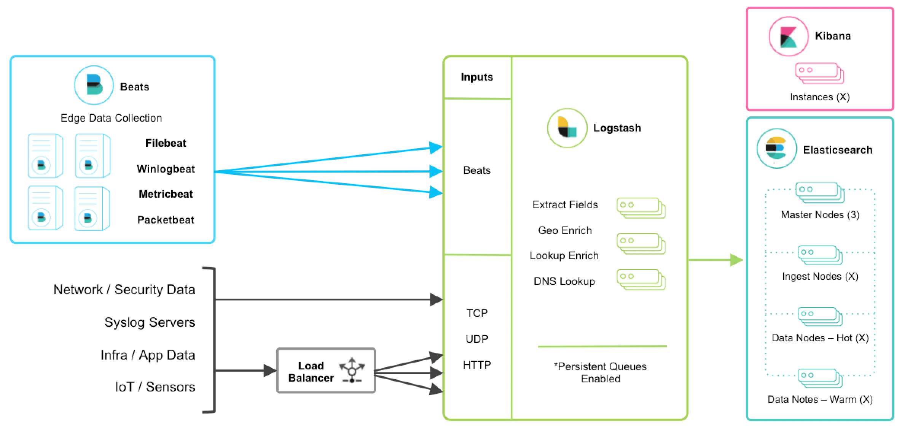

#### 4.5.3、Beats + MQ + Logstath + ElasticSearch + Kibana

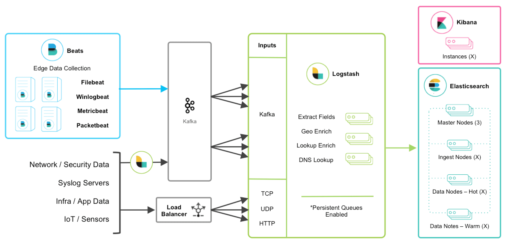

在如上的基础上我们可以在beats和logstash中间添加一些组件redis、kafka、RabbitMQ等，添加中间件将会有如下好处：

1. 降低对日志所在机器的影响，这些机器上一般都部署着反向代理或应用服务，本身负载就很重了，所以尽可能的在这些机器上少做事；

2. 如果有很多台机器需要做日志收集，那么让每台机器都向Elasticsearch持续写入数据，必然会对Elasticsearch造成压力，因此需要对数据进行缓冲，同时，这样的缓冲也可以一定程度的保护数据不丢失；

3. 将日志数据的格式化与处理放到Indexer中统一做，可以在一处修改代码、部署，避免需要到多台机器上去修改配置；

## 五、索引操作

### 5.1、新建索引

```http
PUT /indexName
```

```sh
curl -XPUT "https://172.19.0.2:9200/lindongzhai" -H "kbn-xsrf: reporting"
```

* 创建成功响应

    ```json
    {
      "acknowledged": true,
      "shards_acknowledged": true,
      "index": "lindongzhai"
    }
    ```

    

* 索引已存在错误响应

    ```json
    {
      "error": {
        "root_cause": [
          {
            "type": "resource_already_exists_exception",
            "reason": "index [lindongzhai/A_iSA0wsQnS-gx3u_MsLMg] already exists",
            "index_uuid": "A_iSA0wsQnS-gx3u_MsLMg",
            "index": "lindongzhai"
          }
        ],
        "type": "resource_already_exists_exception",
        "reason": "index [lindongzhai/A_iSA0wsQnS-gx3u_MsLMg] already exists",
        "index_uuid": "A_iSA0wsQnS-gx3u_MsLMg",
        "index": "lindongzhai"
      },
      "status": 400
    }
    ```

    

### 5.2、查询索引

```http
GET /indexName
```

* 索引存在

    ```JSON
    {
      "lindongzhai": {
        "aliases": {},
        "mappings": {},
        "settings": {
          "index": {
            "routing": {
              "allocation": {
                "include": {
                  "_tier_preference": "data_content"
                }
              }
            },
            "number_of_shards": "1",
            "provided_name": "lindongzhai",
            "creation_date": "1703688956328",
            "number_of_replicas": "1",
            "uuid": "A_iSA0wsQnS-gx3u_MsLMg",
            "version": {
              "created": "8500003"
            }
          }
        }
      }
    }
    ```

    

* 索引不存在

    ```json
    {
      "error": {
        "root_cause": [
          {
            "type": "index_not_found_exception",
            "reason": "no such index [lindongzhai1]",
            "resource.type": "index_or_alias",
            "resource.id": "lindongzhai1",
            "index_uuid": "_na_",
            "index": "lindongzhai1"
          }
        ],
        "type": "index_not_found_exception",
        "reason": "no such index [lindongzhai1]",
        "resource.type": "index_or_alias",
        "resource.id": "lindongzhai1",
        "index_uuid": "_na_",
        "index": "lindongzhai1"
      },
      "status": 404
    }
    ```

    

### 5.3、所有索引

```http
GET _cat/indices
```

```json
green  open .internal.alerts-observability.logs.alerts-default-000001      mP05Naz3TpyXv1fVV1wVdw 1 0 0 0 249b 249b 249b
green  open .internal.alerts-observability.uptime.alerts-default-000001    OMsgGuc3T2ujx8c7XdcB_g 1 0 0 0 249b 249b 249b
green  open .internal.alerts-ml.anomaly-detection.alerts-default-000001    N-Hf870fTEmlL9kD_VSNlQ 1 0 0 0 249b 249b 249b
green  open .internal.alerts-observability.slo.alerts-default-000001       Cg3Gv3dsQ6eWzbgPFc72Ww 1 0 0 0 249b 249b 249b
green  open .internal.alerts-observability.apm.alerts-default-000001       RQoc1NeSSSmXdpQiItxqLQ 1 0 0 0 249b 249b 249b
yellow open lindongzhai                                                    A_iSA0wsQnS-gx3u_MsLMg 1 1 0 0 249b 249b 249b
green  open .internal.alerts-observability.metrics.alerts-default-000001   BNLIQDMKRAGa8Vdsj597bQ 1 0 0 0 249b 249b 249b
green  open .kibana-observability-ai-assistant-conversations-000001        zEiFJFoqSwGJhare-nzmOA 1 0 0 0 249b 249b 249b
green  open .internal.alerts-observability.threshold.alerts-default-000001 1lMAyrvWQsu17Npw67nJkg 1 0 0 0 249b 249b 249b
green  open .kibana-observability-ai-assistant-kb-000001                   C95vr9FRR2eKfdzAcdE2bQ 1 0 0 0 249b 249b 249b
green  open .internal.alerts-security.alerts-default-000001                Sr0HV5lyQfy34q0_nk6tlw 1 0 0 0 249b 249b 249b
green  open .internal.alerts-stack.alerts-default-000001                   r4OFtkliQe2Tbh50gChqKw 1 0 0 0 249b 249b 249b
```


> 查询结果说明
>
> | 内容                   | 含义           | 具体描述                                                     |
> | ---------------------- | -------------- | ------------------------------------------------------------ |
> | green                  | health         | 当前服务器健康状态，green（集群完整），yellow（单点正常、集群不完整），red（单点不正常） |
> | open                   | status         | 索引打开、关闭状态                                           |
> | lindongzhai            | index          | 索引名称                                                     |
> | A_iSA0wsQnS-gx3u_MsLMg | uuid           | 索引唯一编号                                                 |
> | 1                      | pri            | 主分片数量                                                   |
> | 1                      | rep            | 副本数量                                                     |
> | 0                      | docs.count     | 可用文档数（已有文档数）                                     |
> | 0                      | docs.deleted   | 已删除文档数（逻辑删除/软删除）                              |
> | 249b                   | store.size     | 主分片和副分片整体占空间大小                                 |
> | 249b                   | pri.store.size | 主分片占空间大小                                             |
>
> 

### 5.4、删除索引

```HTTP
DELETE /indexName
```

* 删除成功

    ```JSON
    {
      "acknowledged": true
    }
    ```

    

* 删除不存在索引

    ```JSON
    {
      "error": {
        "root_cause": [
          {
            "type": "index_not_found_exception",
            "reason": "no such index [lindongzhai1]",
            "resource.type": "index_or_alias",
            "resource.id": "lindongzhai1",
            "index_uuid": "_na_",
            "index": "lindongzhai1"
          }
        ],
        "type": "index_not_found_exception",
        "reason": "no such index [lindongzhai1]",
        "resource.type": "index_or_alias",
        "resource.id": "lindongzhai1",
        "index_uuid": "_na_",
        "index": "lindongzhai1"
      },
      "status": 404
    }
    ```

    

## 六、文档操作

### 6.1、新增文档

#### 6.1.1、方式一：自动生成ID

```http
POST /索引名/_doc
{
	"key": "value"
}
```

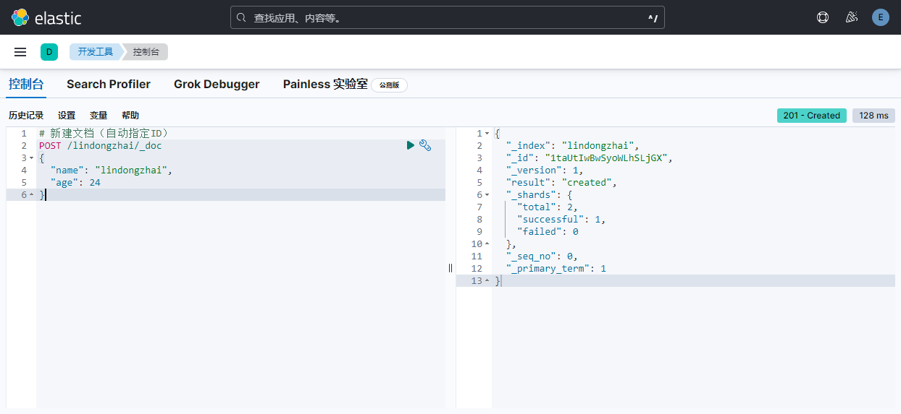

```JSON
{
  "_index": "lindongzhai",       // 当前索引名称
  "_id": "1taUtIwBwSyoWLhSLjGX", // 文档ID
  "_version": 1,                 // 文档版本，增删改都会使版本产生变化
  "result": "created",           // 操作结果，create（创建），update（更新），delete（删除）
  "_shards": {                   // 分片信息
    "total": 2,                  // 总分片数
    "successful": 1,             // 成功分片数 
    "failed": 0                  // 失败分片数
  },
  "_seq_no": 0,                  // 文档序列号，用于分布式环境种保证顺序性
  "_primary_term": 1             // 主分片任期，用于确保在同一时间只有一个主分片处于活动状态，并保证变更操作的一致性。
}
```

#### 6.1.2、方式二：指定ID

```http
POST /索引名/_doc/文档ID
{
	"key": "value"
}
```

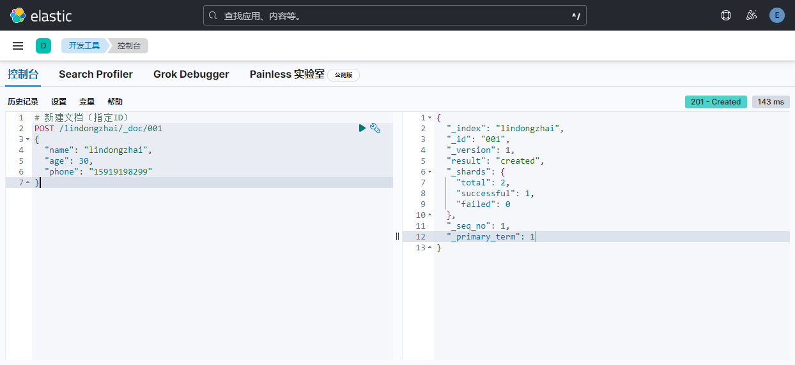

```json
{
  "_index": "lindongzhai",       // 当前索引名称
  "_id": "001", 				 // 文档ID
  "_version": 1,                 // 文档版本，增删改都会使版本产生变化
  "result": "created",           // 操作结果，create（创建），update（更新），delete（删除）
  "_shards": {                   // 分片信息
    "total": 2,                  // 总分片数
    "successful": 1,             // 成功分片数 
    "failed": 0                  // 失败分片数
  },
  "_seq_no": 0,                  // 文档序列号，用于分布式环境种保证顺序性
  "_primary_term": 1             // 主分片任期，用于确保在同一时间只有一个主分片处于活动状态，并保证变更操作的一致性。
}
```

#### 6.1.3、方式三：使用 PUT 新增文档

```http
PUT /索引名称/_doc/文档ID
{
	"key": "value"
}
```

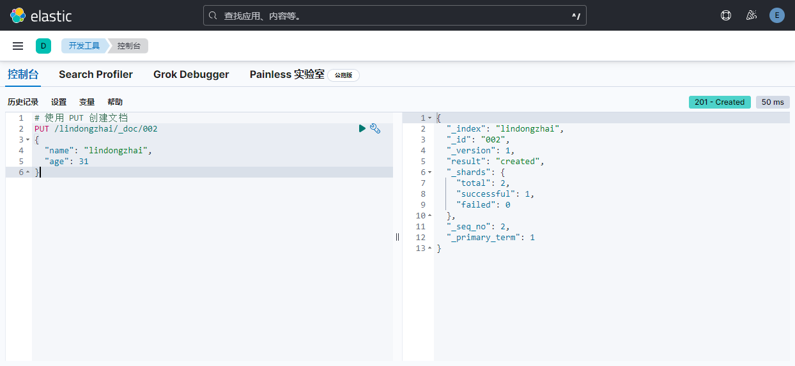

```json
{
  "_index": "lindongzhai",       // 当前索引名称
  "_id": "002", 				 // 文档ID
  "_version": 1,                 // 文档版本，增删改都会使版本产生变化
  "result": "created",           // 操作结果，create（创建），update（更新），delete（删除）
  "_shards": {                   // 分片信息
    "total": 2,                  // 总分片数
    "successful": 1,             // 成功分片数 
    "failed": 0                  // 失败分片数
  },
  "_seq_no": 0,                  // 文档序列号，用于分布式环境种保证顺序性
  "_primary_term": 1             // 主分片任期，用于确保在同一时间只有一个主分片处于活动状态，并保证变更操作的一致性。
}
```


### 6.2、修改文档

#### 6.2.1、方式一：修改所有字段

>  <font color="Orange">注意：这种方式修改，如果不传所有字段，将会把未传的字段清空</font>

```http
POST /索引名称/_doc/文档ID
{
	"key": "value"
}
```

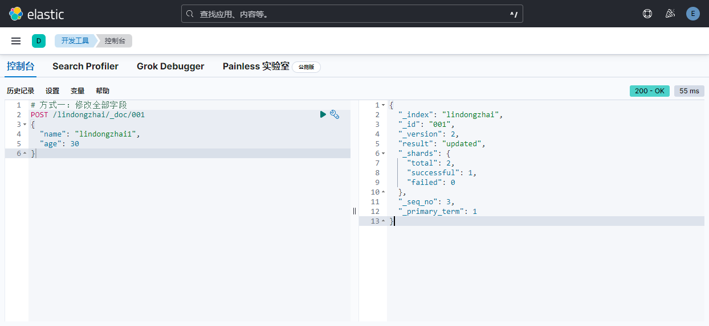

```json
{
  "_index": "lindongzhai",       // 当前索引名称
  "_id": "002", 				 // 文档ID
  "_version": 1,                 // 文档版本，增删改都会使版本产生变化
  "result": "update",            // 操作结果，create（创建），update（更新），delete（删除）
  "_shards": {                   // 分片信息
    "total": 2,                  // 总分片数
    "successful": 1,             // 成功分片数 
    "failed": 0                  // 失败分片数
  },
  "_seq_no": 0,                  // 文档序列号，用于分布式环境种保证顺序性
  "_primary_term": 1             // 主分片任期，用于确保在同一时间只有一个主分片处于活动状态，并保证变更操作的一致性。
}
```

#### 6.2.2、方式二：修改指定字段


### 6.3、删除文档

> <font color="Orange">注意：删除一个文档不会立即从磁盘上移除，它只是被标记成已删除（逻辑删除）</font>

```http
DELETE /索引名称/_doc/文档ID
```

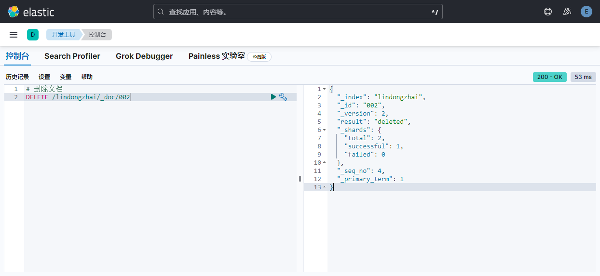

```json
{
  "_index": "lindongzhai",  // 当前索引名称
  "_id": "002",             // 文档ID
  "_version": 2,            // 文档版本，增删改都会使版本产生变化
  "result": "deleted",      // 操作结果，create（创建），update（更新），delete（删除）
  "_shards": {              // 分片信息
    "total": 2,             // 总分片数
    "successful": 1,        // 成功分片数
    "failed": 0             // 失败分片数
  },
  "_seq_no": 4,             // 文档序列号，用于分布式环境种保证顺序性
  "_primary_term": 1        // 主分片任期，用于确保在同一时间只有一个主分片处于活动状态，并保证变更操作的一致性。
}
```

### 6.4、查询文档

#### 6.4.1、方式一：查询单个文档

```http
GET /索引名称/_doc/文档ID[?pretty=true]
```

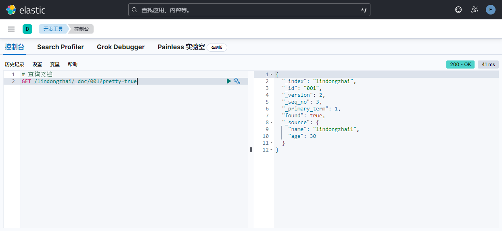

```json
{
  "_index": "lindongzhai",  // 索引名称
  "_id": "001",             // 文档ID
  "_version": 2,            // 文档版本，增删改都会使版本产生变化
  "_seq_no": 3,             // 文档序列号，用于分布式环境种保证顺序性
  "_primary_term": 1,       // 主分片任期，用于确保在同一时间只有一个主分片处于活动状态，并保证变更操作的一致性。
  "found": true,            // 布尔类型字段，表示请求所查找的文档是否存在。
  "_source": {              // 文档内容
    "name": "lindongzhai1",
    "age": 30
  }
}
```

#### 6.4.2、方式二：查询所有文档

```http
GET /索引名称/_search
```

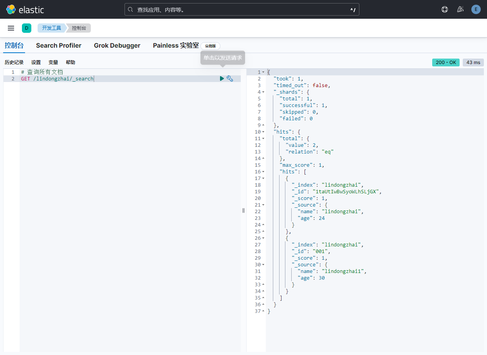

```json
{
  "took": 1,                            // 请求执行时间
  "timed_out": false,                   // 是否超时
  "_shards": {                          //  表示分片的相关信息
    "total": 1,                         // 总分片数
    "successful": 1,                    // 成功分片数
    "skipped": 0,                       // 跳过分片数
    "failed": 0                         // 失败分片数
  },
  "hits": {                             // 搜索结果信息
    "total": {                          // 搜索结果总数的统计信息。
      "value": 2,                       // 匹配的文档数
      "relation": "eq"                  // 与总数量的匹配关系
    },
    "max_score": 1,                     // 最高得分
    "hits": [                           // 命中的文档数组
      {
        "_index": "lindongzhai",        // 索引名称
        "_id": "1taUtIwBwSyoWLhSLjGX",  // 文档ID
        "_score": 1,                    // 文档得分
        "_source": {                    // 文档内容
          "name": "lindongzhai",
          "age": 24
        }
      },
      {
        "_index": "lindongzhai",         // 索引名称
        "_id": "001",                    // 文档ID
        "_score": 1,                     // 文档得分
        "_source": {                     // 文档内容
          "name": "lindongzhai1",
          "age": 30
        }
      }
    ]
  }
}
```


## 七、数据搜索

### 7.1、基础搜索

#### 7.1.1、完全匹配查询

```http
GET /apidoc/_search
{
  "query": {
    "match": {
      "name": "zhangsan"
    }
  }
}
```

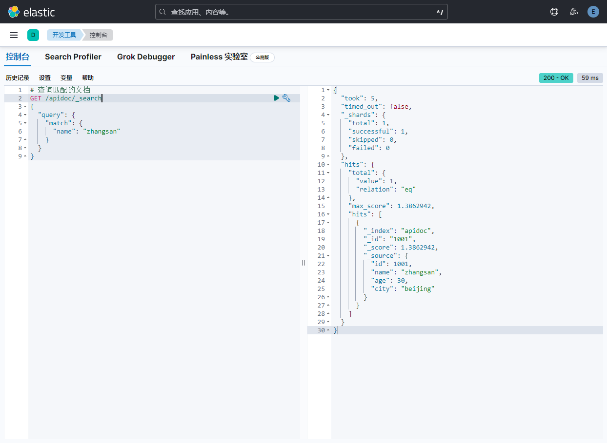

#### 7.1.2、只查询指定字段

```http
GET /apidoc/_search
{
  "_source": ["name", "age"],
  "query": {
    "match": {
      "name": "zhangsan"
    }
  }
}
```

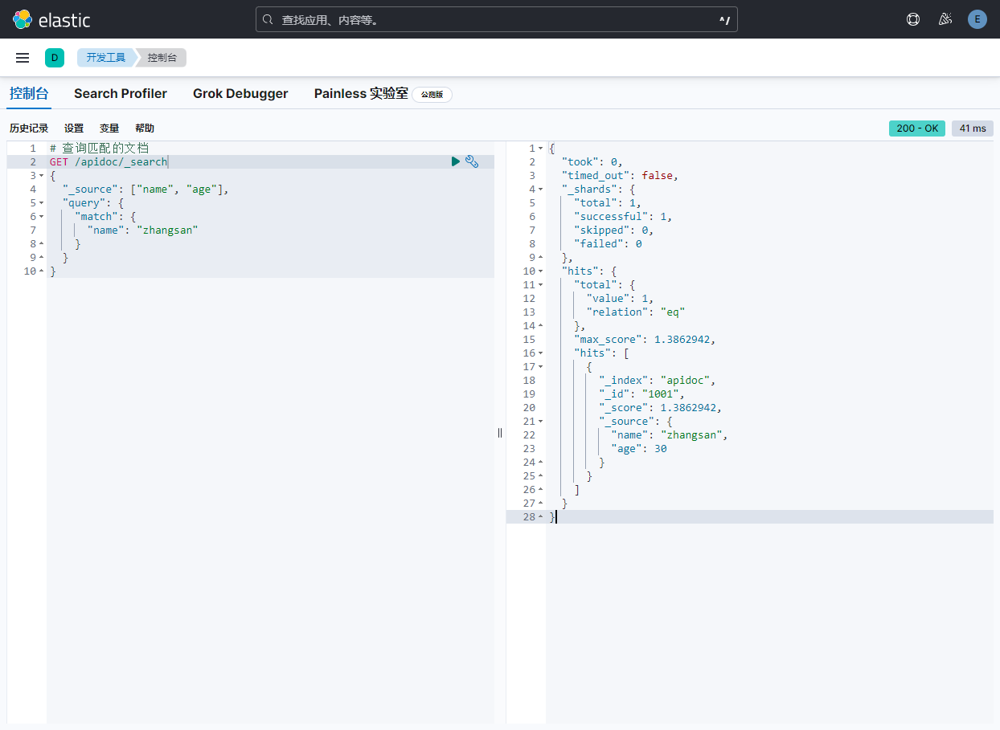

### 7.2、聚合搜索

#### 7.2.1、求平均值

```http
POST /apidoc/_search
{
  "aggs": {
    "avg_age": { // 结果的字段名
      "avg": {
        "field": "age"
      }
    }
  }
}
```

```json
{
  "took": 0,
  "timed_out": false,
  "_shards": {
    "total": 1,
    "successful": 1,
    "skipped": 0,
    "failed": 0
  },
  "hits": {
    "total": {
      "value": 5,
      "relation": "eq"
    },
    "max_score": 1,
    "hits": [
      {
        "_index": "apidoc",
        "_id": "1001",
        "_score": 1,
        "_source": {
          "id": 1001,
          "name": "zhangsan",
          "age": 30,
          "city": "beijing"
        }
      },
      {
        "_index": "apidoc",
        "_id": "1002",
        "_score": 1,
        "_source": {
          "id": 1002,
          "name": "lisi",
          "age": 40,
          "city": "shanghai"
        }
      },
      {
        "_index": "apidoc",
        "_id": "1003",
        "_score": 1,
        "_source": {
          "id": 1003,
          "name": "wangwu",
          "age": 50,
          "city": "beijing"
        }
      },
      {
        "_index": "apidoc",
        "_id": "1004",
        "_score": 1,
        "_source": {
          "id": 1004,
          "name": "zhaoliu",
          "age": 60,
          "city": "beijing"
        }
      },
      {
        "_index": "apidoc",
        "_id": "1005",
        "_score": 1,
        "_source": {
          "id": 1005,
          "name": "tianqi",
          "age": 70,
          "city": "shanghai"
        }
      }
    ]
  },
  "aggregations": {
    "avg_age": { // 名称
      "value": 50 // 平均值
    }
  }
}
```

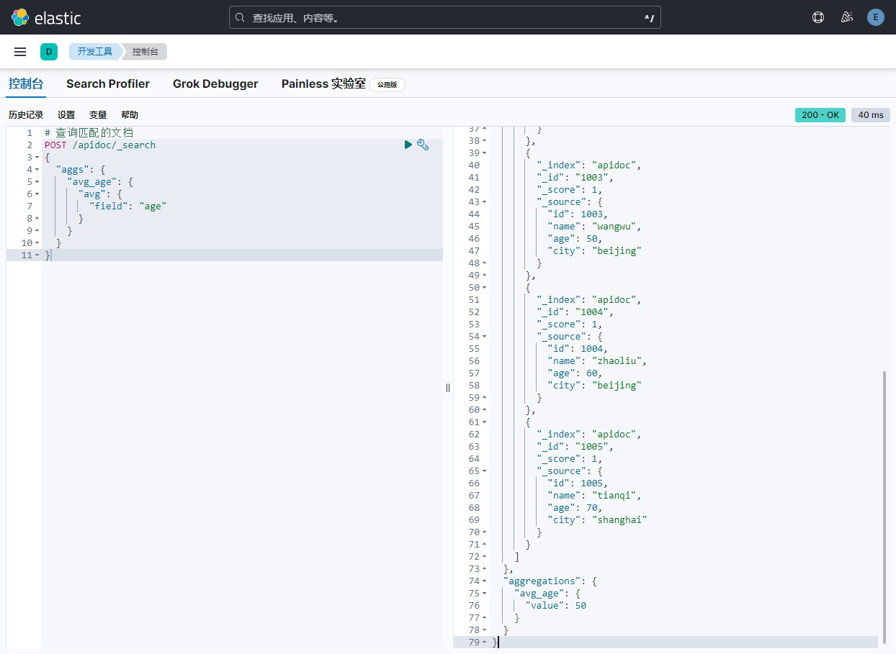

#### 7.2.2、求和

```http
POST /apidoc/_search
{
  "query": {
    "constant_score": {
      "filter": {
        "match": {
          "city": "beijing"
        }
      }
    }
  },
  "aggs": {
    "beijing_prices": {
      "sum": {
        "field": "age"
      }
    }
  }
}
```

```json
{
  "took": 0,
  "timed_out": false,
  "_shards": {
    "total": 1,
    "successful": 1,
    "skipped": 0,
    "failed": 0
  },
  "hits": {
    "total": {
      "value": 3,
      "relation": "eq"
    },
    "max_score": 1,
    "hits": [
      {
        "_index": "apidoc",
        "_id": "1001",
        "_score": 1,
        "_source": {
          "id": 1001,
          "name": "zhangsan",
          "age": 30,
          "city": "beijing"
        }
      },
      {
        "_index": "apidoc",
        "_id": "1003",
        "_score": 1,
        "_source": {
          "id": 1003,
          "name": "wangwu",
          "age": 50,
          "city": "beijing"
        }
      },
      {
        "_index": "apidoc",
        "_id": "1004",
        "_score": 1,
        "_source": {
          "id": 1004,
          "name": "zhaoliu",
          "age": 60,
          "city": "beijing"
        }
      }
    ]
  },
  "aggregations": {
    "beijing_prices": {
      "value": 140
    }
  }
}
```

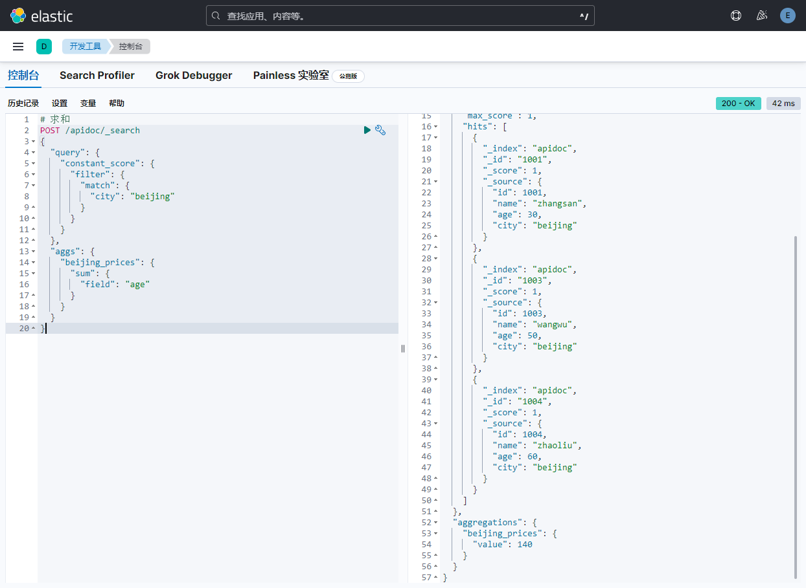

#### 7.2.3、最大值

```http
POST /apidoc/_search
{
  "aggs": {
    "max_prices": {
      "max": {
        "field": "age"
      }
    }
  }
}
```

```json
{
  "took": 1,
  "timed_out": false,
  "_shards": {
    "total": 1,
    "successful": 1,
    "skipped": 0,
    "failed": 0
  },
  "hits": {
    "total": {
      "value": 5,
      "relation": "eq"
    },
    "max_score": 1,
    "hits": [
      {
        "_index": "apidoc",
        "_id": "1001",
        "_score": 1,
        "_source": {
          "id": 1001,
          "name": "zhangsan",
          "age": 30,
          "city": "beijing"
        }
      },
      {
        "_index": "apidoc",
        "_id": "1002",
        "_score": 1,
        "_source": {
          "id": 1002,
          "name": "lisi",
          "age": 40,
          "city": "shanghai"
        }
      },
      {
        "_index": "apidoc",
        "_id": "1003",
        "_score": 1,
        "_source": {
          "id": 1003,
          "name": "wangwu",
          "age": 50,
          "city": "beijing"
        }
      },
      {
        "_index": "apidoc",
        "_id": "1004",
        "_score": 1,
        "_source": {
          "id": 1004,
          "name": "zhaoliu",
          "age": 60,
          "city": "beijing"
        }
      },
      {
        "_index": "apidoc",
        "_id": "1005",
        "_score": 1,
        "_source": {
          "id": 1005,
          "name": "tianqi",
          "age": 70,
          "city": "shanghai"
        }
      }
    ]
  },
  "aggregations": {
    "max_prices": {
      "value": 70
    }
  }
}
```

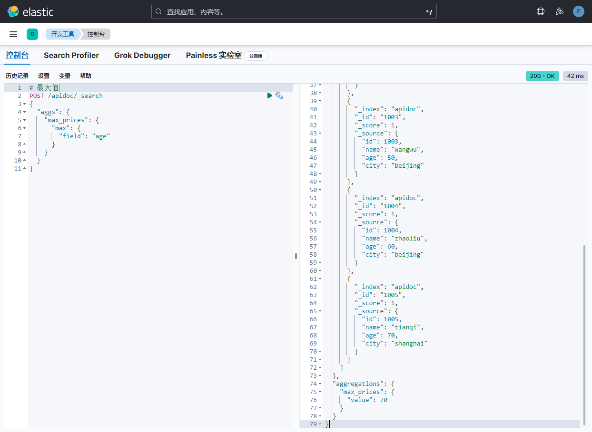

#### 7.2.4、TopN

```http
POST /apidoc/_search
{
  "aggs": {
    "top_tags": {
      "terms": {
        "field": "age",
        "order": {
          "_key": "asc"
        },
        "size": 3
      },
      "aggs": {
        "top_age_hits": {
          "top_hits": {
            "sort": [
              {
                "age": {
                  "order": "desc"
                }
              }
            ],
            "_source": {
              "includes": ["id", "name", "city", "age"]
            },
            "size": 2
          }
        }
      }
    }
  }
}
```

```json
{
  "took": 9,
  "timed_out": false,
  "_shards": {
    "total": 1,
    "successful": 1,
    "skipped": 0,
    "failed": 0
  },
  "hits": {
    "total": {
      "value": 5,
      "relation": "eq"
    },
    "max_score": 1,
    "hits": [
      {
        "_index": "apidoc",
        "_id": "1001",
        "_score": 1,
        "_source": {
          "id": 1001,
          "name": "zhangsan",
          "age": 30,
          "city": "beijing"
        }
      },
      {
        "_index": "apidoc",
        "_id": "1002",
        "_score": 1,
        "_source": {
          "id": 1002,
          "name": "lisi",
          "age": 40,
          "city": "shanghai"
        }
      },
      {
        "_index": "apidoc",
        "_id": "1003",
        "_score": 1,
        "_source": {
          "id": 1003,
          "name": "wangwu",
          "age": 50,
          "city": "beijing"
        }
      },
      {
        "_index": "apidoc",
        "_id": "1004",
        "_score": 1,
        "_source": {
          "id": 1004,
          "name": "zhaoliu",
          "age": 60,
          "city": "beijing"
        }
      },
      {
        "_index": "apidoc",
        "_id": "1005",
        "_score": 1,
        "_source": {
          "id": 1005,
          "name": "tianqi",
          "age": 70,
          "city": "shanghai"
        }
      }
    ]
  },
  "aggregations": {
    "top_tags": {
      "doc_count_error_upper_bound": 0,
      "sum_other_doc_count": 2,
      "buckets": [
        {
          "key": 30,
          "doc_count": 1,
          "top_age_hits": {
            "hits": {
              "total": {
                "value": 1,
                "relation": "eq"
              },
              "max_score": null,
              "hits": [
                {
                  "_index": "apidoc",
                  "_id": "1001",
                  "_score": null,
                  "_source": {
                    "id": 1001,
                    "name": "zhangsan",
                    "age": 30,
                    "city": "beijing"
                  },
                  "sort": [
                    30
                  ]
                }
              ]
            }
          }
        },
        {
          "key": 40,
          "doc_count": 1,
          "top_age_hits": {
            "hits": {
              "total": {
                "value": 1,
                "relation": "eq"
              },
              "max_score": null,
              "hits": [
                {
                  "_index": "apidoc",
                  "_id": "1002",
                  "_score": null,
                  "_source": {
                    "id": 1002,
                    "name": "lisi",
                    "age": 40,
                    "city": "shanghai"
                  },
                  "sort": [
                    40
                  ]
                }
              ]
            }
          }
        },
        {
          "key": 50,
          "doc_count": 1,
          "top_age_hits": {
            "hits": {
              "total": {
                "value": 1,
                "relation": "eq"
              },
              "max_score": null,
              "hits": [
                {
                  "_index": "apidoc",
                  "_id": "1003",
                  "_score": null,
                  "_source": {
                    "id": 1003,
                    "name": "wangwu",
                    "age": 50,
                    "city": "beijing"
                  },
                  "sort": [
                    50
                  ]
                }
              ]
            }
          }
        }
      ]
    }
  }
}
```

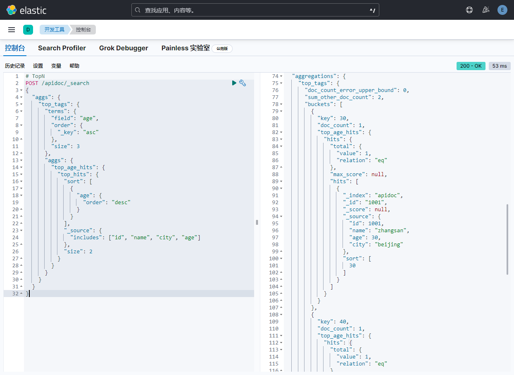

## 八、索引模板

> elasticsearch 在创建索引的时候，就引入了模板的概念，你可以先设置一些通用的模板，在创建索引的时候， elasticsearch 会先根据你创建的模板对索引进行设置。  

> 索引可使用预定义的模板进行创建,这个模板称作 Index templates。模板设置包括 settings 和 mappings

### 8.1、创建模板

```http
PUT _template/apidoctemplate
{
  "index_patterns": [
    "apidoc*"  
  ],
  "settings": {
    "index": {
      "number_of_shards": "1"
    }
  },
  "mappings": {
    "properties": {
      "create_time": {
        "type": "date",
        "format": "yyyy/MM/dd"
      }
    }
  }
}
```

```json
#! Legacy index templates are deprecated in favor of composable templates.
{
  "acknowledged": true
}
```


## 九、中文分词

### 9.1、原生分词

### 9.2、IK分词器


## 六、IK分词器

### 6.1、安装

<font color="Orange">注意：安装的版本需与ElasticSearch版本一致</font>

* 手动安装

	> 下载地址：https://github.com/medcl/elasticsearch-analysis-ik/releases

	```sh
	mkdir -p ES安装目录/plugins/ik
	unzip elasticsearch-analysis-ik-8.11.3.zip -d ES安装目录/plugins/ik
	docker restart ES-contains
	```

* ES命令安装

  ```sh
  cd ES安装目录/
  ```

  


## 十、SDK 使用

### 7.1、Golang

> github：https://github.com/elastic/go-elasticsearch

#### 7.1.1

```sh
go get github.com/elastic/go-elasticsearch/v8@latest
```


### 7.2、Java


### 7.3、Python


## 附录

### 1、ElasticSearch 安装

> 官方教程：https://www.elastic.co/guide/en/elasticsearch/reference/current/install-elasticsearch.html

#### 1.1、docker 安装

```SH
# 创建虚拟网络
docker network create elastic
# 拉取镜像
docker pull docker.elastic.co/elasticsearch/elasticsearch:8.11.3
# 安装证书
wget https://artifacts.elastic.co/cosign.pub
cosign verify --key cosign.pub docker.elastic.co/elasticsearch/elasticsearch:8.11.3
# 执行 ElasticSearch
docker run --name es01 --net elastic -p 9200:9200 -it -m 1GB docker.elastic.co/elasticsearch/elasticsearch:8.11.3
# 后台执行 ElasticSearch
docker run --name es01 --net elastic -p 9200:9200 -it -m 1GB -d docker.elastic.co/elasticsearch/elasticsearch:8.11.3
```

#### 1.2、Windows 安装


#### 1.3、Linux 安装


#### 1.4、Mac 安装


### 2、Kibana 安装

> 官方教程：https://www.elastic.co/guide/en/elasticsearch/reference/current/install-elasticsearch.html

#### 2.1、docker 安装

```sh
# 拉取镜像
docker pull docker.elastic.co/kibana/kibana:8.11.3
# 安装证书
wget https://artifacts.elastic.co/cosign.pub
cosign verify --key cosign.pub docker.elastic.co/kibana/kibana:8.11.3
# 执行 Kibana
docker run --name kib01 --net elastic -p 5601:5601 docker.elastic.co/kibana/kibana:8.11.3
# 后台执行 kibana
docker run --name kib01 --net elastic -p 5601:5601 -d docker.elastic.co/kibana/kibana:8.11.3
```


#### 2.2、Windows 安装

<font color="Orange">注意：需要安装java17+</font>

> 官方教程：https://www.elastic.co/guide/en/kibana/8.11/windows.html

> 下载地址：https://artifacts.elastic.co/downloads/kibana/kibana-8.11.3-windows-x86_64.zip


#### 2.3、Linux 安装

> 官方教程：https://www.elastic.co/guide/en/kibana/8.11/rpm.html#rpm-repo

* yum 安装

  ```shell
  sudo yum install kibana
  ```

* dnf 安装

  ```shell
  sudo dnf install kibana
  ```

* zypper 安装

  ```shell
  sudo zypper install kibana
  ```

  


#### 2.4、Mac 安装

